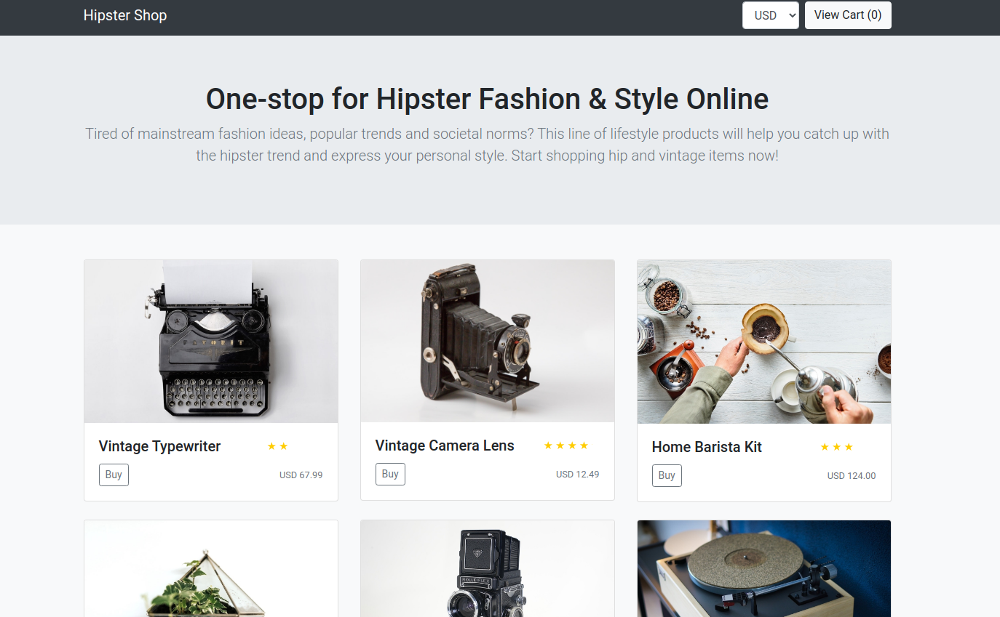
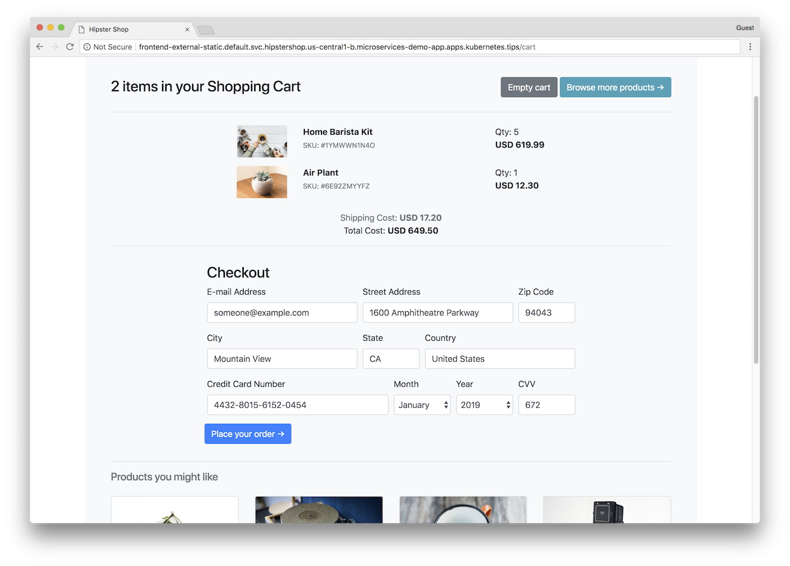

# Stackdriver Sandbox (Alpha)

Stackdriver Sandbox is an open-source tool that helps practitioners to learn Service Reliability Engineering practices from Google and apply them on their cloud services using Stackdriver. It is based on [Hipster Shop](https://github.com/GoogleCloudPlatform/microservices-demo), a cloud-native microservices application.

Sandbox offers:

* **Demo Service** - an application built using microservices architecture on modern, cloud-native stack.
* **One-click deployment**  - a script handles the work of deploying the service to Google Cloud Platform.
* **Load Generator** - a component that produces synthetic traffic on a demo service.
* (Soon) **SRE Runbook** - pre-built routine procedures for operating the deployed sample service that follow best SRE practices using Stackdriver.

## Why Sandbox

Google Stackdriver is a suite of tools that helps you gain full observability of your code and applications. You might want to take Stackdriver to a "test drive" in order to answer the question, "will it work for my application needs"? The most effective way to learn is by testing the tool in "real-life" conditions, but without risking a production system. With Sandbox, we provide a tool that automatically provisions a new demo cluster, which receives traffic, simulating real users. Practicioners can experiment with various Stackdriver tools to solve problems and accomplish standard SRE tasks in a sandboxed environment.

## Getting Started

* Using Sandbox
  * [Prerequisites](#Prerequisites)
  * [Set Up](#Set-Up)
  * [Next Steps](#Next-Steps)
  * [Clean Up](#Clean-Up)
* [Service Overview](#Service-Overview)
  * [Screenshots](#Screenshots)
  * [Architecture](#Architecture)
* Contribute code to Sandbox
  * [Running locally](#Running-locally)
  * [Running on GKE](#Running-on-GKE)
  * [Using static images](#Using-static-images)
  * [GKE with Istio](#GKE-with-Istio)

## Using Sandbox

### Prerequisites

* Create and enable [Cloud Billing Account](https://cloud.google.com/billing/docs/how-to/manage-billing-account).

### Set Up

1. Click the Cloud Shell button for automated one-click installation of a new Stackdriver Sandbox cluster in a new Google Cloud Project.

[](https://console.cloud.google.com/cloudshell/editor?cloudshell_git_repo=https://github.com/GoogleCloudPlatform/stackdriver-sandbox.git&cloudshell_git_branch=master&cloudshell_working_dir=terraform&cloudshell_image=gcr.io/cloudshell-images/cloudshell)

1. In the Cloud Shell command prompt, type:

```bash
./install.sh
```

### Next Steps

* Explore your Sandbox deployment and its [architecture](#Service-Overview)
* Learn more about Stackdriver using [Code Labs](https://codelabs.developers.google.com/gcp-next/?cat=Monitoring)

### Clean Up

When you are done using Stackdriver Sandbox, you can tear down the environment by deleting the GCP project that was set up for you. This can be accomplished in any of the following ways:

* Use the Stackdriver Sandbox `destroy` script:

```bash
./destroy.sh
```

* If you no longer have the Stackdriver Sandbox files downloaded, delete your project manually using `gcloud`

```bash
gcloud projects delete $YOUR_PROJECT_ID
```

* Delete your project through Google Cloud Console's [Resource Manager web interface](https://console.cloud.google.com/cloud-resource-manager)

## Service Overview

This project contains a 10-tier microservices application. It is a
web-based e-commerce app called **“Hipster Shop”**, where users can browse items,
add them to the cart, and purchase them.

### Screenshots

| Home Page | Checkout Screen |
|-----------|-----------------|
| [](./docs/img/hipster-shop-frontend-1.png) | [](./docs/img/hipster-shop-frontend-2.png) |

### Service Architecture

**Hipster Shop** is composed of many microservices, written in different languages, that talk to each other over gRPC.
>**We are not endorsing the architecture of Hipster Shop as the best way to build such a shop!**
> The architecture is optimized for learning purposes and includes modern stack: Kubernetes, GKE, Istio,
> Stackdriver, gRPC, OpenCensus, and similar cloud-native technologies.

[](./docs/img/architecture-diagram.png)

Find the **Protocol Buffers Descriptions** in the [`./pb` directory](./pb).

| Service | Language | Description |
|---------|----------|-------------|
| [frontend](./src/frontend) | Go | Exposes an HTTP server to serve the website. Does not require signup/login, and generates session IDs for all users automatically. |
| [cartservice](./src/cartservice) |  C# | Manages the items in the user's shipping cart by using Redis. |
| [productcatalogservice](./src/productcatalogservice) | Go | Provides the list of products from a JSON file and the ability to search and retrieve products. |
| [currencyservice](./src/currencyservice) | Node.js | Converts one currency to another, using real values fetched from  the European Central Bank. It's the highest QPS service. |
| [paymentservice](./src/paymentservice) | Node.js | Charges the given credit card info (hypothetically😇) with the given amount and returns a transaction ID. |
| [shippingservice](./src/shippingservice) | Go | Gives shipping-cost estimates based on the shopping cart. Ships items to the given address (hypothetically😇). |
| [emailservice](./src/emailservice) | Python | Sends users an order-confirmation email (hypothetically😇). |
| [checkoutservice](./src/checkoutservice) | Go | Retrieves a user's cart, prepares the order, and orchestrates payment, shipping, and email notification. |
| [recommendationservice](./src/recommendationservice) | Python | Recommends other products based on what's in the user's cart. |
| [adservice](./src/adservice) | Java | Provides text ads based on given context words. |
| [loadgenerator](./src/loadgenerator) | Python/Locust | Continuously sends requests that imitate realistic shopping flows to the frontend. |

### Technologies

* **[Kubernetes](https://kubernetes.io)/[GKE](https://cloud.google.com/kubernetes-engine/):**
  The app is designed to run on Google Kubernetes Engine.
* **[gRPC](https://grpc.io):** Microservices use a high volume of gRPC calls to
  communicate to each other.
* **[OpenCensus](https://opencensus.io/) Tracing:** Most services are
  instrumented using OpenCensus trace interceptors for gRPC/HTTP.
* **[Stackdriver APM](https://cloud.google.com/stackdriver/):** Many services
  are instrumented with **Profiling**, **Tracing** and **Debugging**.
  **Metrics** and **Context Graph** out of the box.
* **[Skaffold](https://github.com/GoogleContainerTools/skaffold):** A tool used for doing repeatable deployments. You can deploy to Kubernetes with a single command using Skaffold.
* **Synthetic Load Generation:** The application demo comes with dedicated load generation service that creates realistic usage patterns on Hipster Shop website using
  [Locust](https://locust.io/) load generator.

## For Developers

> **Note:** The first build can take up to 30 minutes. Subsequent builds
> will be faster.

### Option 1: Running locally with “Docker for Desktop”

> 💡 Recommended if you're planning to develop the application.

1. Install tools to run a Kubernetes cluster locally:

   * kubectl (can be installed via `gcloud components install kubectl`)
   * Docker for Desktop (Mac/Windows): It provides Kubernetes support as [noted
     here](https://docs.docker.com/docker-for-mac/kubernetes/).
   * [skaffold](https://github.com/GoogleContainerTools/skaffold/#installation)
     (ensure version ≥v0.20)

1. Launch “Docker for Desktop”. Go to **Preferences**:
   * Choose **Enable Kubernetes**
   * Set **CPUs** to at least 3
   * Set **Memory** to at least 6.0 GiB

1. Run `kubectl get nodes` to verify you're connected to “Kubernetes on Docker”.

1. Run `skaffold run` (first time will be slow; it can take up to 30 minutes).
   This will build and deploy the application. If you need to rebuild the images
   automatically as you refactor he code, run the `skaffold dev` command.

1. Run `kubectl get pods` to verify the Pods are ready and running. The
   application frontend should be available at <http://localhost:80> on your
   machine.

### Option 2: Running on Google Kubernetes Engine (GKE)

> 💡  Recommended for demos and making it available publicly.

1. Install tools specified in the previous section (Docker, kubectl, skaffold)

1. Create a Google Kubernetes Engine cluster and make sure `kubectl` is pointing
   to the cluster:

```bash
gcloud services enable container.googleapis.com

gcloud container clusters create demo --enable-autoupgrade \
    --enable-autoscaling --min-nodes=3 --max-nodes=10 --num-nodes=5 --zone=us-central1-a

kubectl get nodes
```

1. Enable Google Container Registry (GCR) on your GCP project and configure the
   `docker` CLI to authenticate to GCR:

```bash
gcloud services enable containerregistry.googleapis.com

gcloud auth configure-docker -q
```

1. In the root of this repository, run `skaffold run --default-repo=gcr.io/[PROJECT_ID]`,
   where [PROJECT_ID] is the identifier for your GCP project.

   This command:
   * Builds the container images.
   * Pushes them to GCR.
   * Applies the `./kubernetes-manifests` deploying the application to
     Kubernetes.

   **Troubleshooting:** If you get the error "No space left on device" on Google
   Cloud Shell, you can build the images on Google Cloud Build. To do this:
   1. [Enable the Cloud Build
       API](https://console.cloud.google.com/flows/enableapi?apiid=cloudbuild.googleapis.com).

   2. Run `skaffold run -p gcb  --default-repo=gcr.io/[PROJECT_ID]`.

1. Find the IP address of your application, then visit the application on your
    browser to confirm installation.

```bash
kubectl get service frontend-external
```

> **Troubleshooting:** A Kubernetes bug (will be fixed in 1.12) combined with
> a Skaffold [bug](https://github.com/GoogleContainerTools/skaffold/issues/887)
> causes the load balancer to not work, even after getting an IP address. If you
> are seeing this, run `kubectl get service frontend-external -o=yaml | kubectl apply -f-`
> to trigger load-balancer reconfiguration.

### Option 3: Using Static Images

> 💡 Recommended for test-driving the application on an existing cluster.

**Prerequisite**: a running Kubernetes cluster.

1. Clone this repository.
1. Deploy the application: `kubectl apply -f ./release/kubernetes-manifests`  
1. Run `kubectl get pods` to see pods are in a healthy and ready state.
1. Find the IP address of your application, then visit the application on your
    browser to confirm installation.

```bash
kubectl get service frontend-external
```

### Generate Synthetic Traffic

1. If you want to create synthetic load manually, use the `loadgenerator-tool` executable found in the root of the repository. For example:

```bash
./loadgenerator-tool startup --zone us-central1-c [SANDBOX_FRONTEND_ADDRESS]
```

### (Optional) Deploying on a Istio-installed GKE cluster

> **Note:** If you followed GKE deployment steps above, run `skaffold delete` first
> to delete what's deployed.

1. Create a GKE cluster (described above).

1. Use [Istio on GKE add-on](https://cloud.google.com/istio/docs/istio-on-gke/installing)
   to install Istio to your existing GKE cluster.

```bash
gcloud beta container clusters update demo \
    --zone=us-central1-a \
    --update-addons=Istio=ENABLED \
    --istio-config=auth=MTLS_PERMISSIVE
```

> NOTE: If you need to enable `MTLS_STRICT` mode, you will need to update
> several manifest files:
>
> * `kubernetes-manifests/frontend.yaml`: delete "livenessProbe" and
>   "readinessProbe" fields.
> * `kubernetes-manifests/loadgenerator.yaml`: delete "initContainers" field.

1. (Optional) Enable Stackdriver Tracing/Logging with Istio Stackdriver Adapter
   by following [this guide](https://cloud.google.com/istio/docs/istio-on-gke/installing#enabling_tracing_and_logging).

1. Install the automatic sidecar injection (annotate the `default` namespace
   with the label):

```bash
kubectl label namespace default istio-injection=enabled
```

1. Apply the manifests in [`./istio-manifests`](./istio-manifests) directory.

```bash
kubectl apply -f ./istio-manifests
```

This is required only once.

1. Deploy the application with `skaffold run --default-repo=gcr.io/[PROJECT_ID]`.

1. Run `kubectl get pods` to see pods are in a healthy and ready state.

1. Find the IP address of your Istio gateway Ingress or Service, and visit the
   application.

```bash
INGRESS_HOST="$(kubectl -n istio-system get service istio-ingressgateway -o jsonpath='{.status.loadBalancer.ingress[0].ip}')"
echo "$INGRESS_HOST"
curl -v "http://$INGRESS_HOST"
```

---

This is not an official Google project.
